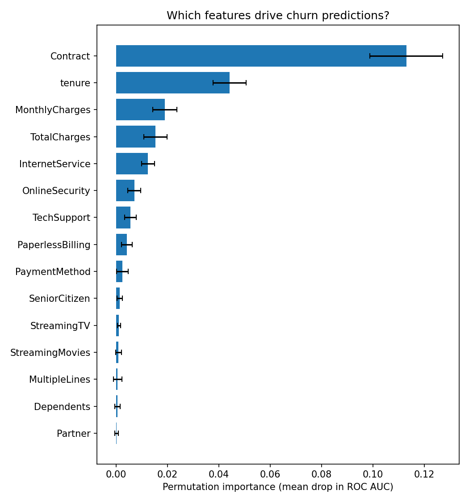

# Customer Churn Prediction — End-to-End MLOps

A small but complete, **production-style** machine-learning project: it predicts
customer churn (Telco Customer Churn schema) and ships everything around the model —
a clean training pipeline, a REST API, containerisation, experiment tracking, tests
and continuous integration.

## What it demonstrates

- **Modelling:** a scikit-learn `Pipeline` (median/most-frequent imputation, scaling,
  one-hot encoding) + a **HistGradientBoosting** classifier, evaluated with
  5-fold cross-validated AUC and a held-out test set.
- **Serving:** a **FastAPI** service (`/predict`, `/health`) with a typed Pydantic
  request schema.
- **Packaging:** an installable package (`pip install -e .`) and a **Dockerfile**
  that trains a model at build time and serves it.
- **Reproducibility & ops:** **MLflow** experiment tracking, **pytest** test suite,
  and **GitHub Actions** CI that runs the tests on every push.

The dataset loader works with the real IBM Telco Customer Churn CSV if provided, and
otherwise **generates a synthetic dataset with the same schema and a realistic churn
signal**, so the whole project is runnable out of the box.

## Results (real IBM Telco Customer Churn dataset)

Trained on the real IBM Telco Customer Churn dataset (7,043 customers, 26.5% churn):

| Metric | Value |
|--------|------:|
| 5-fold CV AUC | **0.832 ± 0.013** |
| Test AUC | **0.823** |
| Test F1 | 0.555 |
| Test accuracy | 0.777 |

(The project also ships a synthetic generator with the same schema, so it runs
out of the box without the CSV; on synthetic data the AUC is ≈ 0.73.)

### What drives churn (explainability)

Permutation feature importance (mean drop in test ROC AUC when each feature is
shuffled) identifies the contract type as by far the strongest churn driver,
followed by tenure and charges — consistent with the churn literature:



| Feature | Importance |
|---------|-----------:|
| Contract | 0.113 |
| tenure | 0.044 |
| MonthlyCharges | 0.019 |
| TotalCharges | 0.015 |
| InternetService | 0.013 |

Reproduce with `python scripts/explain.py --csv data/Telco-Customer-Churn.csv`.

## Data

The project works with the **IBM Telco Customer Churn** dataset. Download
`Telco-Customer-Churn.csv` (e.g. from the
[IBM sample repo](https://github.com/IBM/telco-customer-churn-on-icp4d) or Kaggle)
into `data/` and pass `--csv data/Telco-Customer-Churn.csv`. If no CSV is given, a
**synthetic dataset with the same schema** is generated automatically, so everything
runs without any download.

## Quick start

```bash
pip install -e ".[dev]"

# Train (synthetic data by default; pass --csv path/to/Telco.csv for the real one)
python -m churn.train --no-mlflow

# Serve the API
uvicorn churn.api:app --reload
# POST a customer to http://localhost:8000/predict  (see /docs for the schema)

# Run the tests
pytest
```

### Docker

```bash
docker build -t churn-api .
docker run -p 8000:8000 churn-api
```

### Example request

```bash
curl -X POST localhost:8000/predict -H "Content-Type: application/json" -d '{
  "Contract": "Month-to-month", "tenure": 2, "MonthlyCharges": 95.0,
  "InternetService": "Fiber optic", "PaymentMethod": "Electronic check"
}'
# -> {"churn_probability": 0.7x, "churn": true}
```

## Layout

```
.
├── src/churn/
│   ├── data.py       # real-CSV loader + synthetic Telco-schema generator
│   ├── pipeline.py   # preprocessing + HistGradientBoosting pipeline
│   ├── train.py      # train, cross-validate, MLflow logging, save model
│   ├── api.py        # FastAPI service (/predict, /health)
│   └── explain.py    # permutation feature importance + plot
├── tests/            # pytest: data, pipeline and API
├── Dockerfile
├── .github/workflows/ci.yml   # GitHub Actions (tests on push)
└── pyproject.toml
```

## License

Released under the MIT License — see `LICENSE`.
